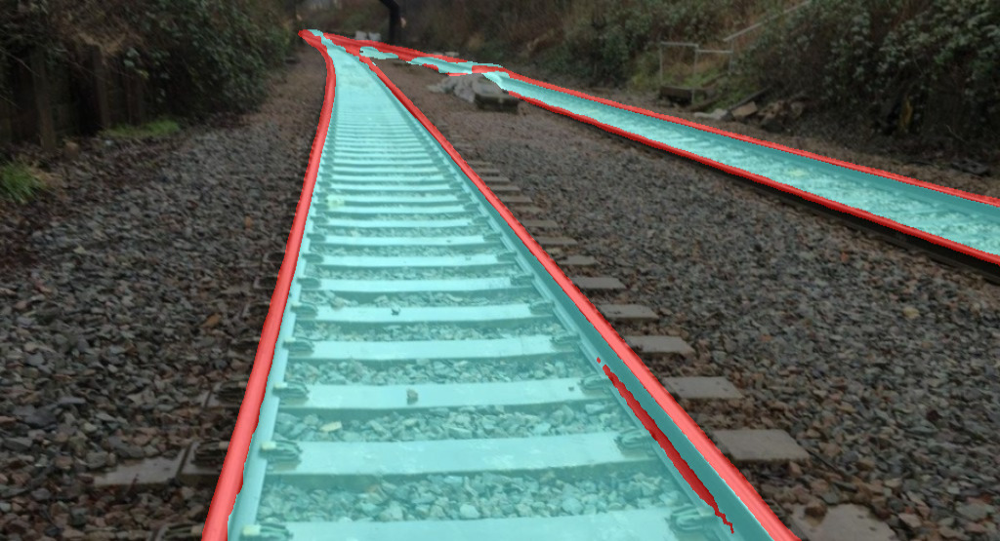

# 📝 proof-of-concept rail marking detections for autonomous train system #
***

This project implements rail-track detection using fast semantic segmentation for high-resolution images from [bisenetv2 algorithm](https://arxiv.org/abs/2004.02147).

The author of [bisenetv2](https://arxiv.org/abs/2004.02147) has not made the official implementation public so the implementation in this project might yeild different performance with the network introduced in the original paper.

This project trains [bisenetv2](https://arxiv.org/abs/2004.02147) on a modified version of [RailSem19 dataset](https://ieeexplore.ieee.org/document/9025646) with only three labels ("rail-raised", "rail-track", "background"). Please follow [here](https://wilddash.cc/railsem19) if you want to download the original dataset.


## :tada: TODO
***

- [x] Implement bisenetv2 and train on modified railsem19 dataset
- [ ] Refine the semantic mask using connected components algorithm
- [ ] Cluster the mask to obtain seperate railtrack

## 🎛  Dependencies
***

- create rail_marking conda environment

```bash
    conda env create --file environment.yml
```

- activate conda environment
```bash
    conda activate rail_marking
```

## :running: How to Run ##
***

Download trained weights from [HERE](https://drive.google.com/file/d/11FAmJR79bmO0SjzQIqBvWD8Zy9MTWYw2/view?usp=sharing).

- Test single image

```bash
    python ./scripts/segmentation/test_one_image.py -snapshot [path/to/trained/weight] -image_path [path/to/image/path]
```

Sample segmentation result:



- Test video

Download sample video from [HERE](https://drive.google.com/file/d/1B4FDdsaGF_F6Gm-E4ayOOG8A2EEbCyBQ/view?usp=sharing).

The video was originally downloaded from this [youtube channel](https://www.youtube.com/watch?v=-5T-J_Bp0g4).

```bash
    python ./scripts/segmentation/test_video.py -snapshot [path/to/trained/weight] -video_path [path/to/video/path]
```

The test result can be seen as the gif image above.
The frame rate could reach 40fps, faster than needed for an autonomous system.

## :gem: References ##
***

- [BiSeNet V2: Bilateral Network with Guided Aggregation for Real-time Semantic Segmentation](https://arxiv.org/abs/2004.02147)
- [RailSem19: A Dataset for Semantic Rail Scene Understanding](https://openaccess.thecvf.com/content_CVPRW_2019/html/WAD/Zendel_RailSem19_A_Dataset_for_Semantic_Rail_Scene_Understanding_CVPRW_2019_paper.html)
